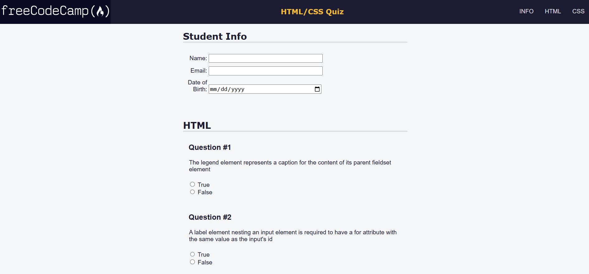
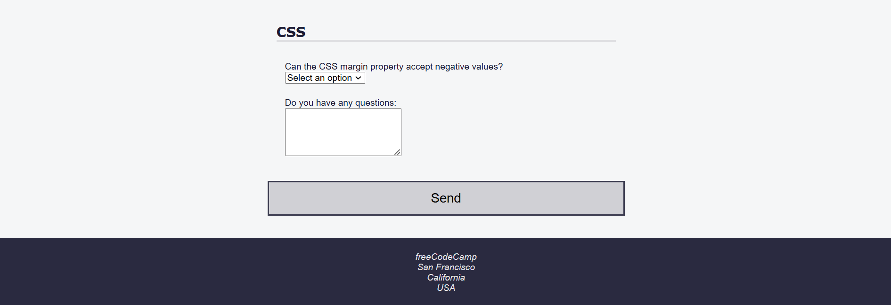

# Accessibility Quiz

A responsive accessibility quiz project built using HTML and CSS as part of the FreeCodeCamp Responsive Web Design certification course.

## Description

The quiz tests knowledge of HTML and CSS elements, attributes, and properties, with a focus on accessibility. It is designed to be fully responsive and easy to navigate, with considerations for mobile and desktop users. The project includes various sections for HTML and CSS questions, along with form inputs like radio buttons, checkboxes, and a textarea.

## Features

- Fully responsive design that adapts to different screen sizes.
- HTML and CSS questions with multiple-choice options.
- Form inputs for name, email, and date of birth.
- Semantic HTML with accessibility attributes (e.g., ARIA).
- A fixed navigation bar with links to different quiz sections.
- Button for form submission.

## Technologies Used

- HTML
- CSS

## How to Run

1. Clone the repository to your local machine.
2. Open `accessibilityQuiz.html` in your web browser.

## Acknowledgments

This project was completed as part of the FreeCodeCamp Responsive Web Design certification course. Special thanks to FreeCodeCamp for providing the resources and guidance.
